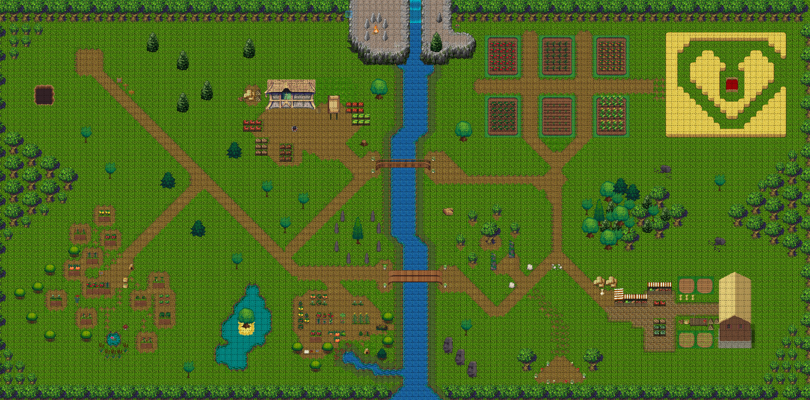

# opensrcgardens-at-rc3

This is a tiled map that has been created for the Remote Chaos Experience #RC3 

It creates a digital Open Source Garden, where openness is sown and freedom is reaped. when you walk around you will find information about Open Source Seeds embedded from https://opensourcegardens.info/ . Be welcome to create this garden yourself by implementing this repository into a running workadventu.re environment or visit one of the running instances.

The map creation is published CC-BY-SA 4.0 by Open Source Gardens. Licenses of the tilesets in use are written in the COPYRIGHT.txt, usually CC-BY-SA 3.0.

Screenshof the whole map:
 
